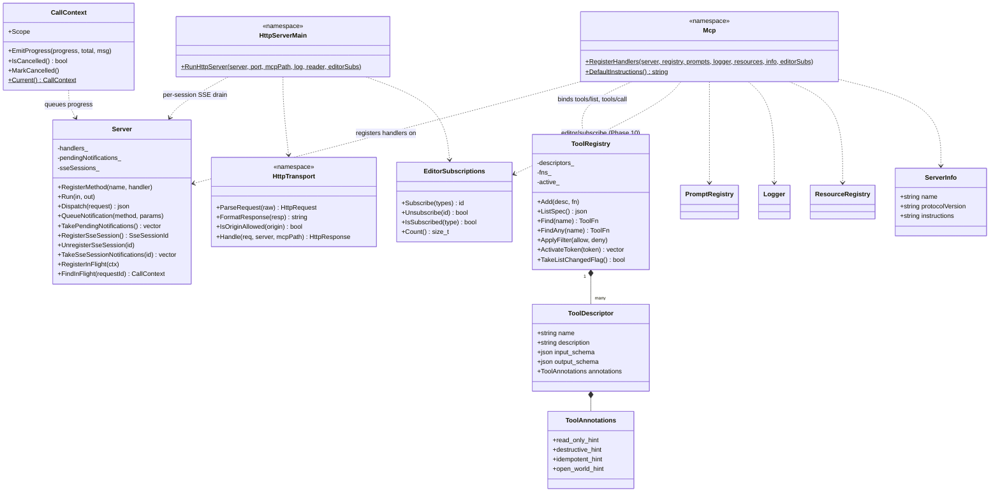
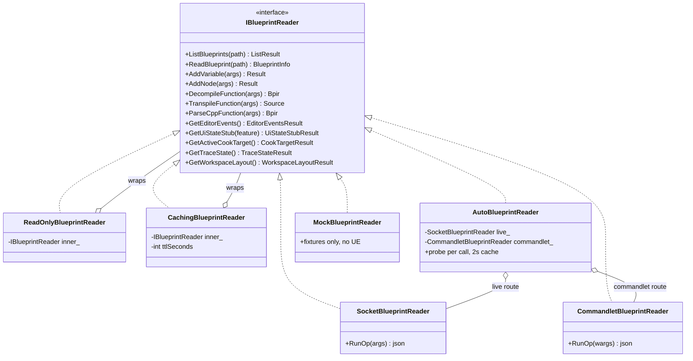
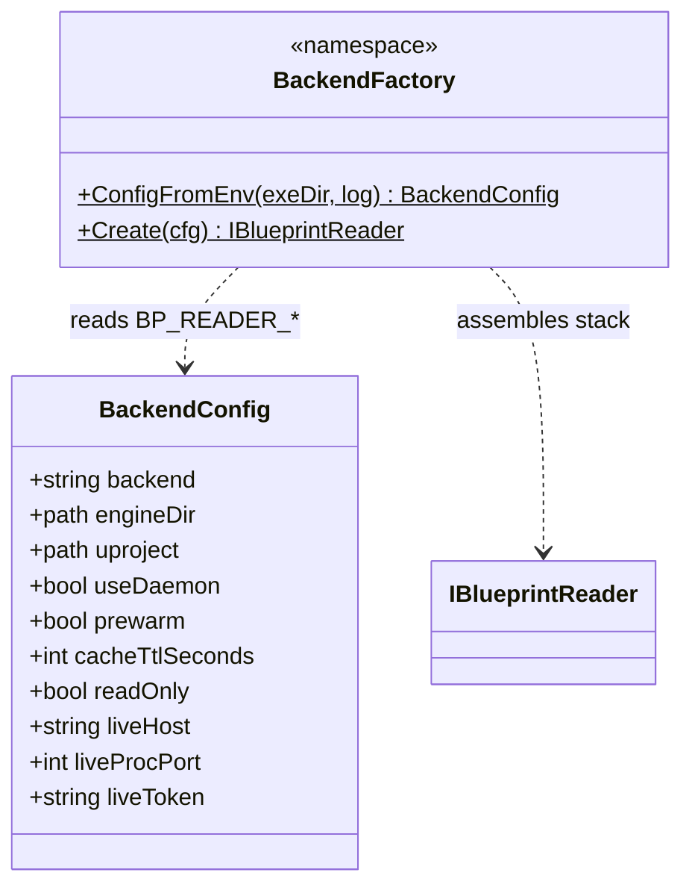
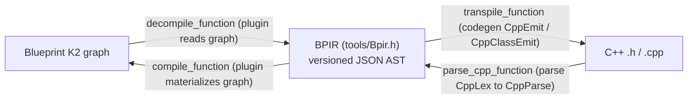
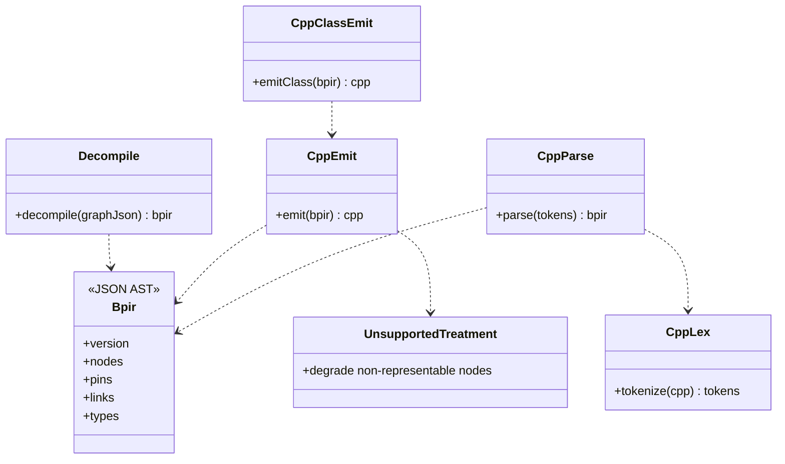
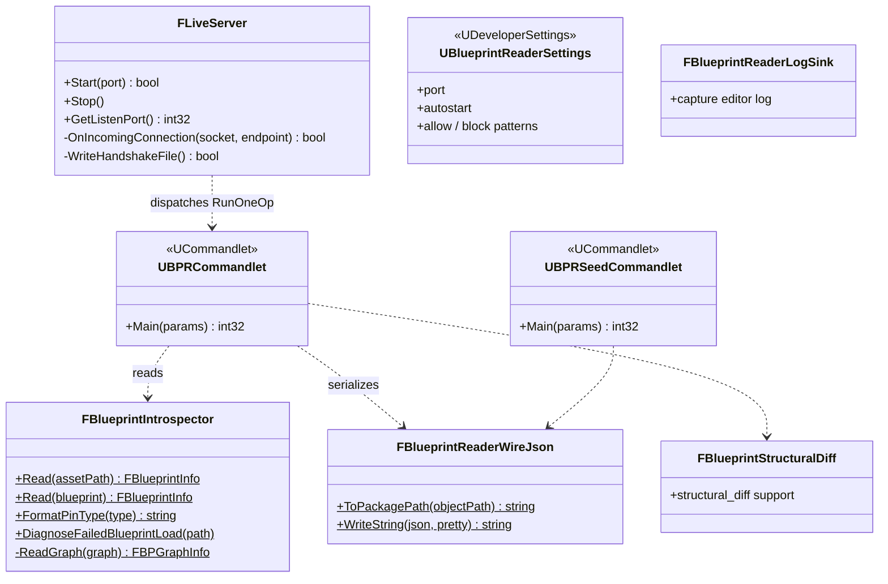
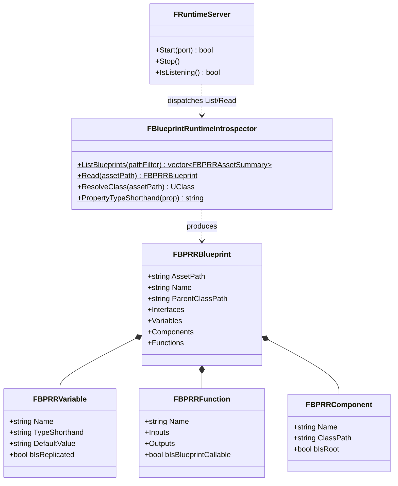
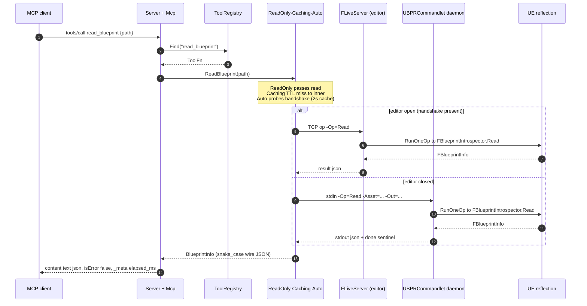
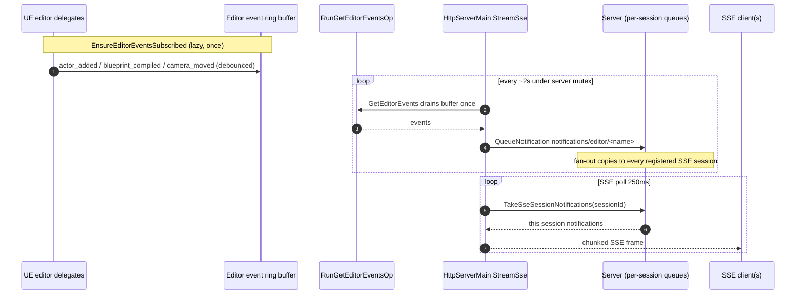

# Architecture (UML)

A structural map of the **whole system** — both halves of the plugin:

1. **`bp-reader-mcp.exe`** — a standalone, out-of-process C++20 MCP
   server (a UE *Program* target, but it links no engine runtime). Speaks
   JSON-RPC 2.0 to MCP clients and drives the editor over a subprocess or
   socket.
2. **`BlueprintReader` UE plugin** — two modules loaded *inside* the UE
   process: `BlueprintReaderEditor` (full introspection + mutation, editor
   only) and `BlueprintReaderRuntime` (read-only reflection, ships in
   cooked builds).

The hard line between them is a **process boundary**: the server never
links UE; the plugin never links nlohmann/json. They meet over a wire
protocol — CreateProcessW + stdin/stdout for `commandlet`, newline-JSON
over loopback TCP for `live`.

> These diagrams are [Mermaid](https://mermaid.js.org/); GitHub renders
> them inline. Source of truth is the headers under
> `Plugins/BlueprintReader/` — see the [file map](#source-map) at the end.

---

## 1. System component view

How a request flows from an MCP client to UE reflection and back, across
the process boundary, for each backend.

```mermaid
flowchart LR
    subgraph clients["MCP clients"]
        direction TB
        CC["Claude Code / Desktop"]
        CP["GitHub Copilot (VS Code)"]
        GP["ChatGPT (HTTPS bridge)"]
    end

    subgraph proc_server["Process A - bp-reader-mcp.exe (no UE linkage)"]
        direction TB
        MAIN["main.cpp<br/>transport + backend select"]
        TRANSPORT{"transport"}
        STDIO["Server.Run<br/>stdio framing"]
        HTTP["HttpServerMain<br/>HTTP + chunked SSE"]
        MCP["mcp::RegisterHandlers<br/>initialize / tools.* / ping"]
        REG["ToolRegistry<br/>~249 ToolDescriptors"]
        BTOOLS["RegisterBlueprintTools<br/>handlers"]
        CHAIN["IBlueprintReader chain<br/>ReadOnly to Caching to Auto"]
        MAIN --> TRANSPORT
        TRANSPORT -->|default| STDIO
        TRANSPORT -->|BP_READER_HTTP_PORT| HTTP
        STDIO --> MCP
        HTTP --> MCP
        MCP --> REG
        BTOOLS --> REG
        BTOOLS --> CHAIN
    end

    subgraph proc_editor["Process B - UnrealEditor-Cmd.exe + BlueprintReaderEditor.dll"]
        direction TB
        DAEMON["UBPRCommandlet<br/>-run=BPR (-Daemon)"]
        LIVE["FLiveServer<br/>loopback TCP listener"]
        RUNONE["RunOneOp dispatch<br/>EOp table"]
        INTRO["FBlueprintIntrospector"]
        WIRE["FBlueprintReaderWireJson"]
        DAEMON --> RUNONE
        LIVE --> RUNONE
        RUNONE --> INTRO
        RUNONE --> WIRE
    end

    subgraph proc_cooked["Process C - packaged game + BlueprintReaderRuntime.dll (opt-in)"]
        direction TB
        RTSRV["FRuntimeServer<br/>loopback TCP (off by default)"]
        RTINTRO["FBlueprintRuntimeIntrospector"]
        RTSRV --> RTINTRO
    end

    UEREFL["UE - UClass reflection, Asset Registry, K2 graphs, CDO"]

    clients -->|"JSON-RPC 2.0 over stdio or HTTP"| MAIN
    CHAIN -->|"CreateProcessW + stdin pipe (commandlet)"| DAEMON
    CHAIN -->|"newline-JSON over TCP (live)"| LIVE
    CHAIN -.->|"newline-JSON over TCP (live to cooked)"| RTSRV
    INTRO --> UEREFL
    RTINTRO --> UEREFL
```

**Auto** (the default) re-probes on every call with a 2 s cache: if the
editor's `FLiveServer` handshake file is present it routes to `live`,
otherwise it spawns/feeds the `commandlet` daemon.

---

## 2. MCP server core (JSON-RPC + tools)

The transport-agnostic core. `Server` knows only JSON-RPC framing +
method handlers; `mcp::RegisterHandlers` layers the MCP protocol on top;
`ToolRegistry` holds the tool surface. The MCP layer never interprets
tool semantics — it only knows the registry.

`CallContext` is thread-local ambient state set around each `tools/call`
so long-running tools (cook, package, automation) can `EmitProgress()`
and poll `IsCancelled()` without changing the `ToolFn` signature.
`ToolRegistry` supports both a static allow/deny filter and runtime
progressive disclosure (the `enable_tool_category` meta-tool sets
`listChanged_`, which the dispatcher turns into
`notifications/tools/list_changed`).

---

## 3. Backend chain (the decorator stack)

Every tool handler calls one `IBlueprintReader`. The concrete object is a
**decorator stack** assembled by `BackendFactory::Create`:

`ReadOnly` → `Caching` → `Auto` → ( `Socket`(live) | `Commandlet` | `Mock` )

Each layer adds one concern: `ReadOnly` rejects write tools, `Caching`
memoizes reads on a TTL, `Auto` probes per call and forwards to the live
or commandlet leaf.

`IBlueprintReader` carries roughly one virtual per tool family (~240).
`AutoBlueprintReader` forwards every op through a `FORWARD` macro, so new
tools are picked up automatically. Adding one tool touches all of:
`IBlueprintReader` (virtual) → Mock/Commandlet/Socket/Caching/ReadOnly/Auto
(impl) → `BlueprintTools.cpp` (descriptor + handler) → plugin `RunXxxOp`.

---

## 4. BPIR — the BP to source pivot

`decompile_function`, `transpile_function`, and `parse_cpp_function` all
operate on **BPIR**, a versioned JSON AST. Adding Lua/Python/JS later is
another `codegen + parse` pair against the same IR.

---

## 5. UE plugin — editor module (`BlueprintReaderEditor`)

Editor-only (`Type=Editor`, stripped from non-editor targets by UBT).
Full introspection + mutation. Two entry points share one dispatch
(`RunOneOp` over the `EOp` table): the commandlet daemon (stdin lines)
and `FLiveServer` (loopback TCP frames, dispatched on the game thread).

`RunOneOp` is a free-function dispatch table (`EOp` enum →
`RunReadOp` / `RunAddVariableOp` / `RunGetEditorEventsOp` / …). Lazy
editor-delegate subscriptions (`EnsureEditorEventsSubscribed`) push 13
Tier-A + Tier-B/C debounced events into a ring buffer drained by
`get_editor_events` — see [§8](#8-sequence--ea-push-events-phase-1015).

---

## 6. UE plugin — runtime module (`BlueprintReaderRuntime`)

`Type=Runtime` — loads in editor **and** packaged builds. Read-only
`UClass` reflection (asset registry, parent chain, UPROPERTY vars with
CDO defaults, UFUNCTION signatures, SCS/CDO components). Cannot read K2
graphs (stripped during cook → `graphs[]` empty).

`FRuntimeServer` is **off by default** (a shipping game should not open a
port silently); opt in with the `bp.reader.listen` CVar or
`BP_READER_RUNTIME_LISTEN=1`. It speaks the same wire protocol as
`FLiveServer`, so the MCP server's `live` backend works against either.
Two console commands give in-game triage: `bp_reader.list <Path>` and
`bp_reader.read <AssetPath>`.

---

## 7. Sequence — a `tools/call` end-to-end

`read_blueprint` through the default `auto` backend, showing both routes.

---

## 8. Sequence — EA-push events (Phase 10/15)

User actions in a live editor become `notifications/editor/*` over the
HTTP SSE stream, fanned out per session.

`editor/subscribe` (advertised only when `BP_READER_PUSH_EVENTS=1`)
registers interest in event types via `EditorSubscriptions`; the poll
skips unsubscribed events. The per-session fan-out means two connected
clients each get their own copy — neither steals the other's.

---

## Source map

| Diagram | Source of truth |
|---|---|
| Server core (§2) | `Tests/BlueprintReaderMcpCore/Private/jsonrpc/{Server,Mcp,CallContext,HttpServerMain,HttpTransport,SseFrame}.h` |
| Tools (§2) | `…/Private/tools/{ToolRegistry,BlueprintTools,EditorSubscriptions,ToolAnnotations}.h` |
| Backends (§3) | `…/Private/backends/{IBlueprintReader,ReadOnly,Caching,Auto,Commandlet,Socket,Mock}*.h`, `BackendFactory.h` |
| BPIR (§4) | `…/Private/tools/{Bpir,Decompile}.h`, `…/tools/codegen/*`, `…/tools/parse/*` |
| Editor module (§5) | `Source/BlueprintReaderEditor/Public/*.h` + `Private/BlueprintReaderCommandlet.cpp` (`RunOneOp` / `EOp`) |
| Runtime module (§6) | `Source/BlueprintReaderRuntime/Public/{BlueprintRuntimeIntrospector,BlueprintReaderRuntimeServer}.h` |

The 7-file pattern for adding a tool, build/test commands, and gotchas
live in [`CLAUDE.md`](https://github.com/defessler/Unreal-Engine-5-MCP/blob/main/CLAUDE.md);
tool usage is in [Tool Reference](Tool-Reference); the BP-to-C++ IR is in
[BPIR](BPIR).
